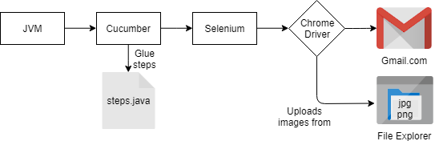
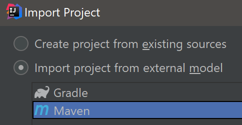
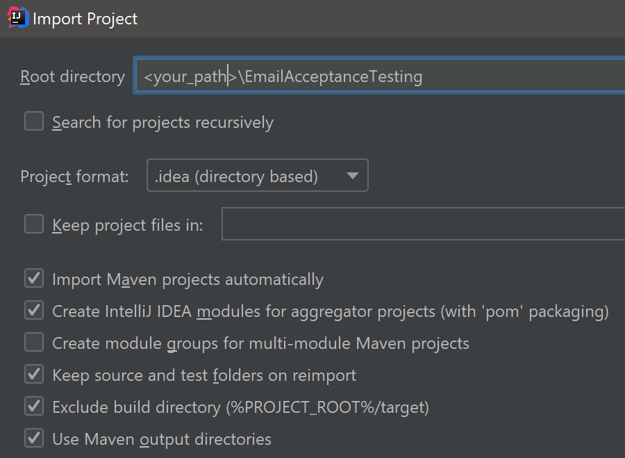
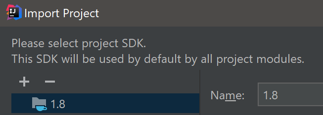
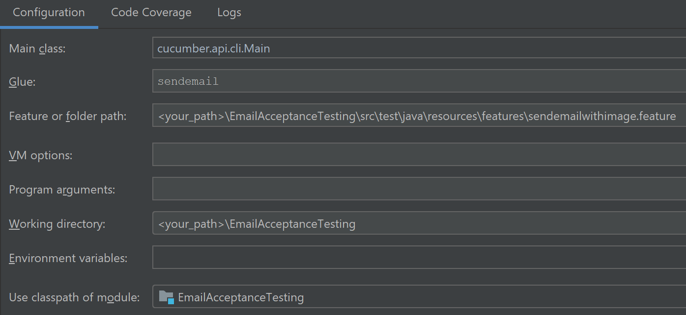
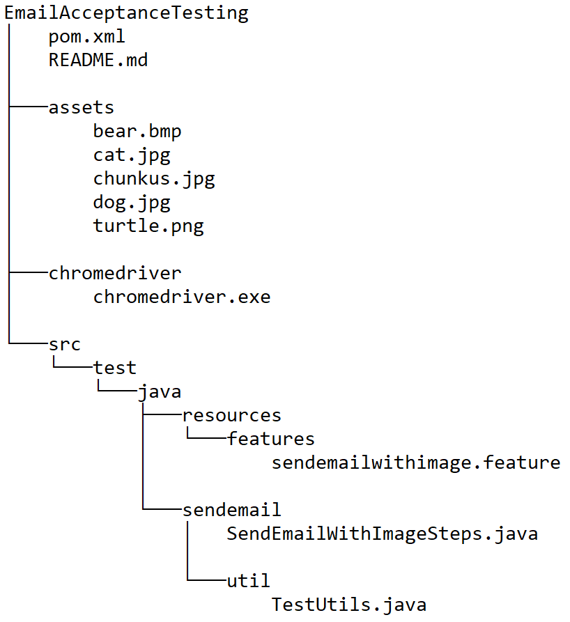

# EmailAcceptanceTesting

This repository runs a suite of tests to confirm that an email is correctly sent with an image attachement.

## Test Environment Description

Cucumber is an open source testing platform which can automate the testing of business readable specifications against code of any modern development stack. The specification are written in Gherkin which gives structure and meaning to executable specifications.

The IDE used for the developpement was IntelliJ which was able to integrate easily with cucumber through maven dependencies. IntelliJ can be downloaded for free [here](https://www.jetbrains.com/idea/download/).

Selenium was used to interact with the web page. Selenium is a suite of tools which can automate browser interaction through many platforms. Selenium is used to navigate through pages, click buttons, type, and perform any other actions that a human would to reproduce the various scenarios. The browser chosen for the test is Google Chrome. The drivers for the browser for selenium to use are included in the repository which facilitates the setup.

The feature file (sendemailwithimage.feature) which contains the Gherkin specification is ran through IntelliJ which translates each step directly to Java code (SendEmailWithImageSteps.java). This file  uses selenium to interact with the web browser. More detailed instructions can be found in the [Setup Instructions for Test Environment section](#Setup-Instructions-for-Test-Environment) section.

<p align="center">

</p>

The Cucumber framework runs on Java and glues the corresponding steps of the Gherkin script to the steps definition Java file. The steps themselves call the selenium library which can interact with the web page through the Google Chrome web driver.

## Setup Instructions for Test Environment

First clone the repository locally.

``` $ git clone https://github.com/vaquierm/EmailAcceptanceTesting.git ```

The project can then be imported from IntelliJ as a Maven project.



Check the ‘Import Maven Projects Automatically checkbox’



Select Java 8 (SDK 1.8)



Create a Cucumber Java run configuration with the following setup.



This configuration should be able to run all scenarios defined in the sendemailwithimage.feature file.

## Repository contents

All code is contained in the EmailAcceptanceTesting folder. This is the folder that should be imported with IntelliJ to run the Tests. The figure below shows the structure of the repository.

- The pom.xml contain all maven dependencies required for the project.
- The assets folder contain the images that are attached to the emails when they are sent.
- The chromedriver folder contains the Google Chrome web driver which selenium uses to interact with the web page
- The src folder contains all java code and cucumber feature files.
 - The /test/java/ressources/feature/ folder contains the .feature cucumber files where the Gherkin scenarios are defined.
 - The /test/java/sendemail/ folder contain the java code which uses the selenium library.
  - The SendEmailWithImageSteps.java file contains the step definitions for each Gherkin step for Cucumber to glue.
  - The /util/ folder contains a utility file with helper functions to interact with the web driver.


